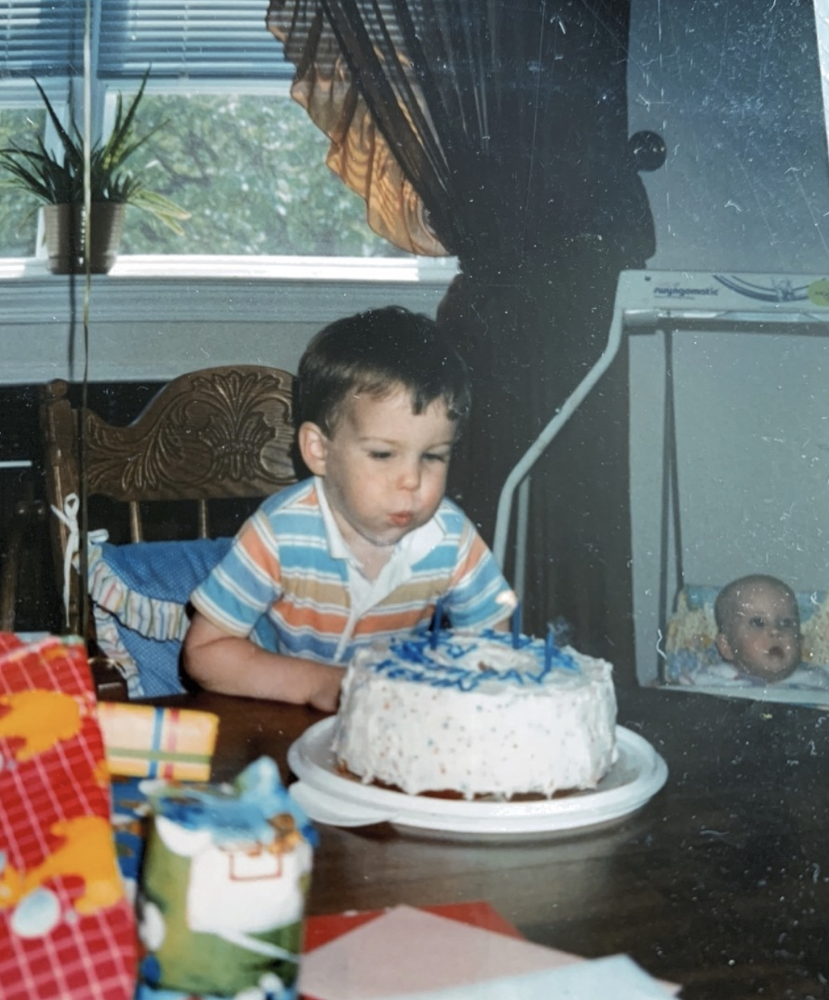

Today would have marked Kevin’s 40th birthday, and while we continue to feel the deep loss of his presence, we also choose to celebrate the incredible life he lived and the joy he brought to so many. 

In honor of this milestone, the Kevin Humes Memorial Foundation made a donation to the Eagles Autism Foundation — an organization that reflects causes Kevin believed in and values he held close. Supporting this foundation is a meaningful way to carry forward his legacy of compassion, inclusion, and community. 

To celebrate Kevin in a more personal way, we took a trip to the beach — his favorite place — where we shared stories and quiet moments of reflection. It was a day filled with good memories, and a reminder of the love that continues to surround him. 

Happy Heavenly 40th, Kevin. You are missed, remembered, and always celebrated. 

