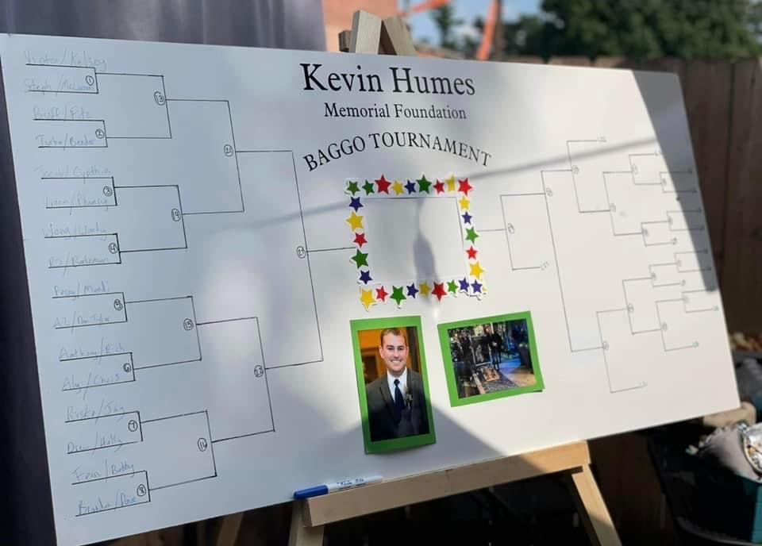
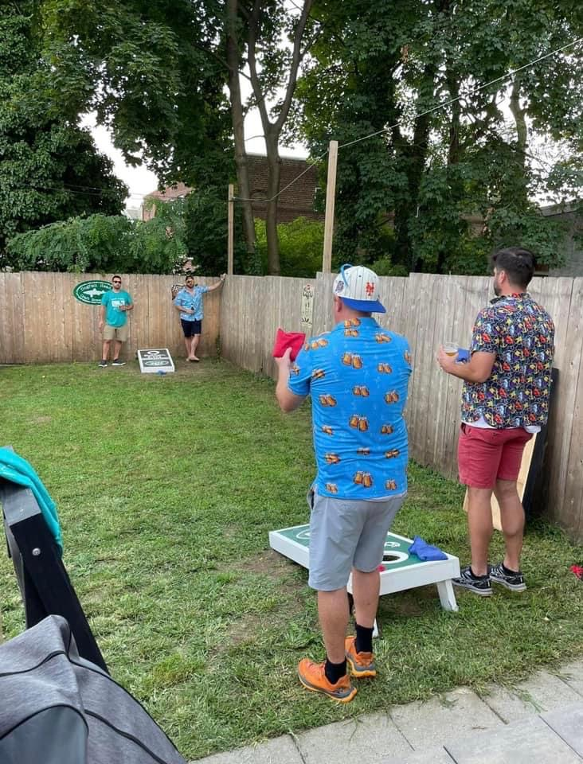
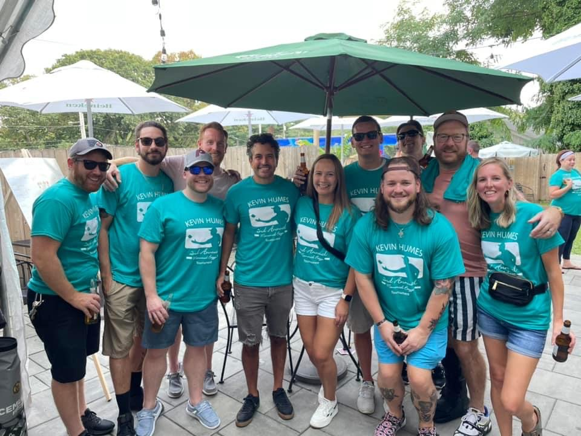
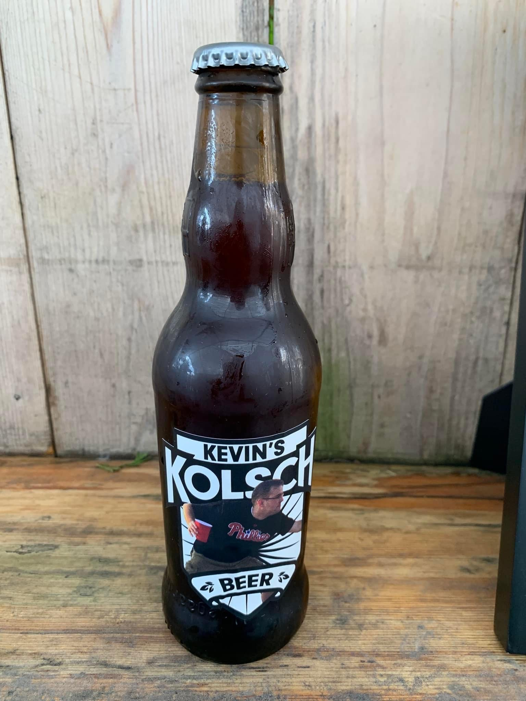
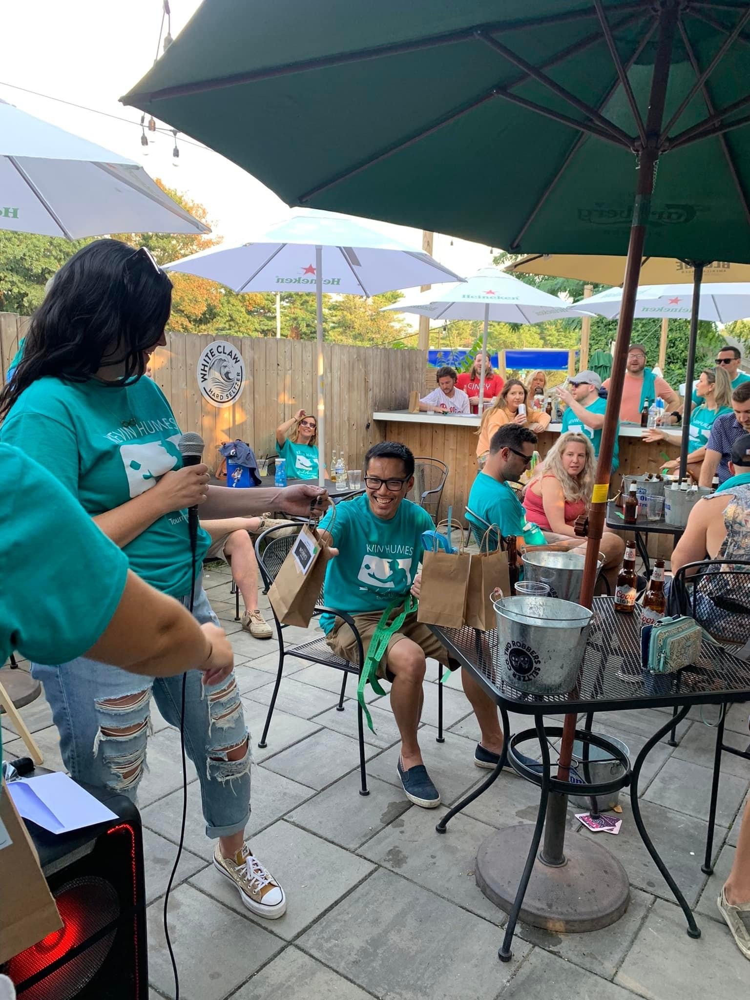
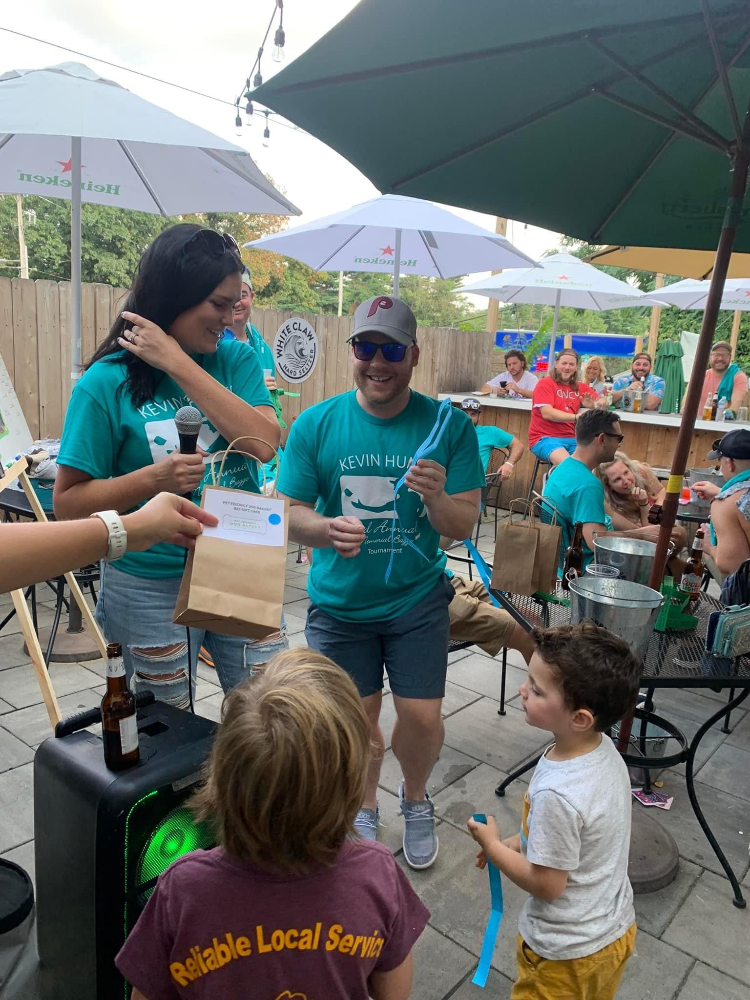
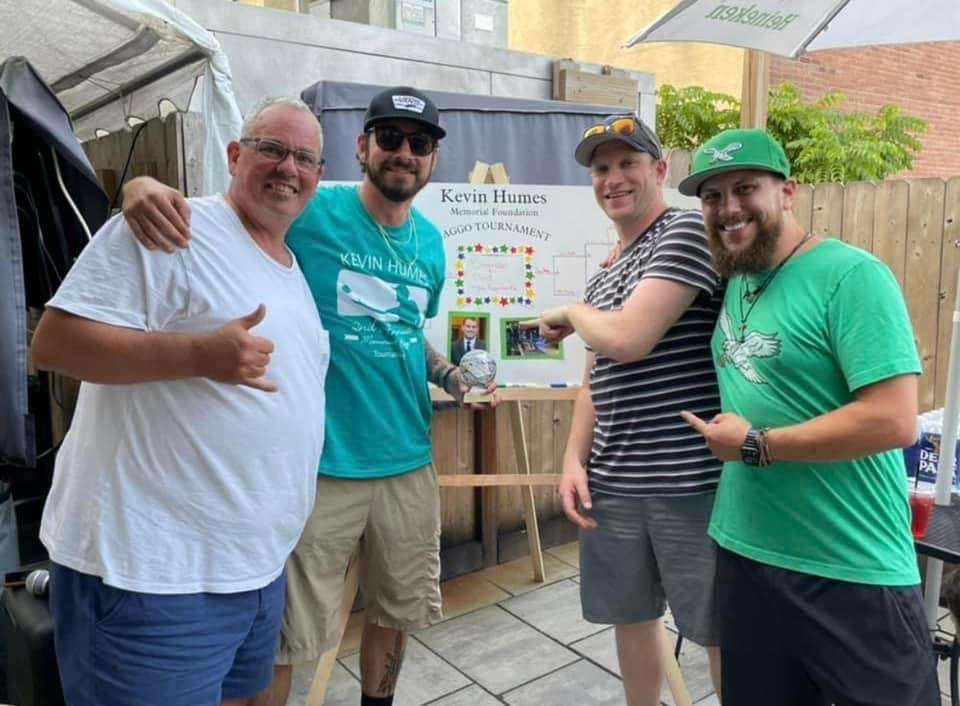
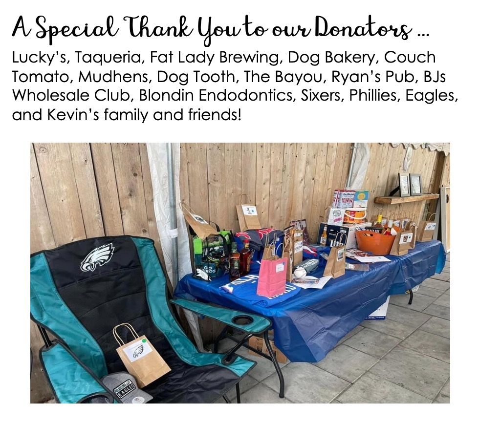

We had our 2nd annual Cornhole Tournament in memory of Kevin. This
successful event was full of friendly Cornhole competition, an exciting raffle, and fond memories of Kevin. Through the entry fee and raffle, we raised $2,217 to support local charities in Kevin’s memory! We will post those donations when they go out so stay tuned.

A special thank you to …
- RJ for organizing the event
- Alick and Jimmy for making “Kevin’s Kolch”
- Cythina and Jason (@youwraps) for creating a label for the beer
- Lauren for helping setup the raffle
- Henry James Saloon for hosting our event
- Local companies (you can see a list in our pictures) that donated to our raffle

And of course Congrats to our Baggo Champions for the 2nd year in a row - Brandon and Dave! Let’s see if they can continue to hold the title next year!

