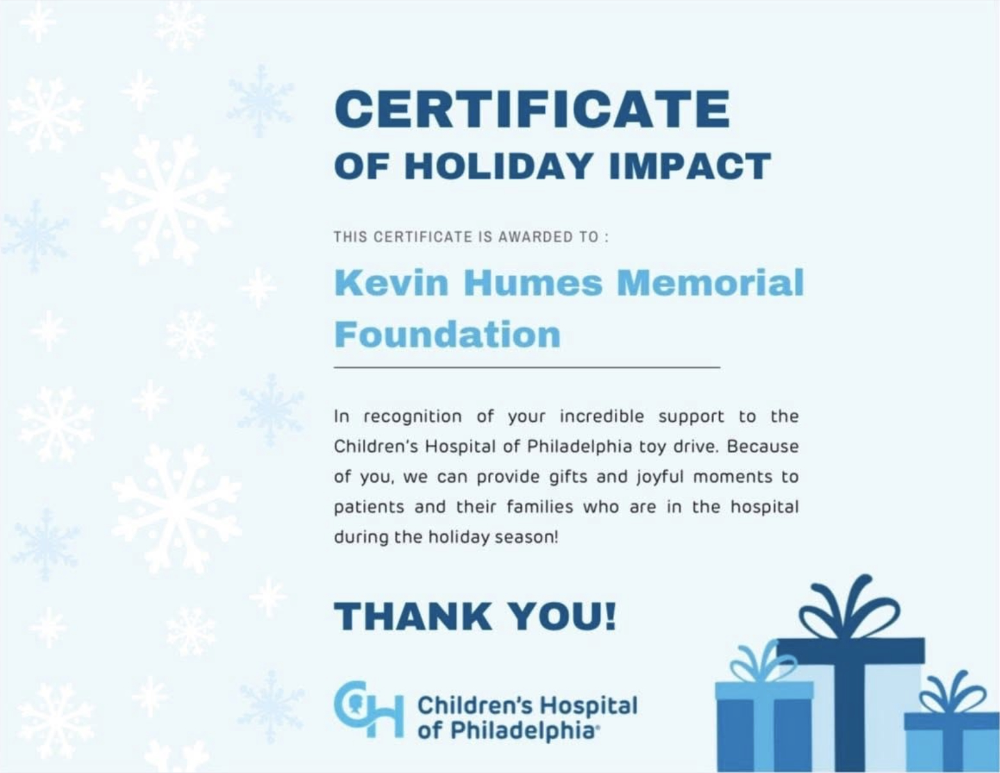
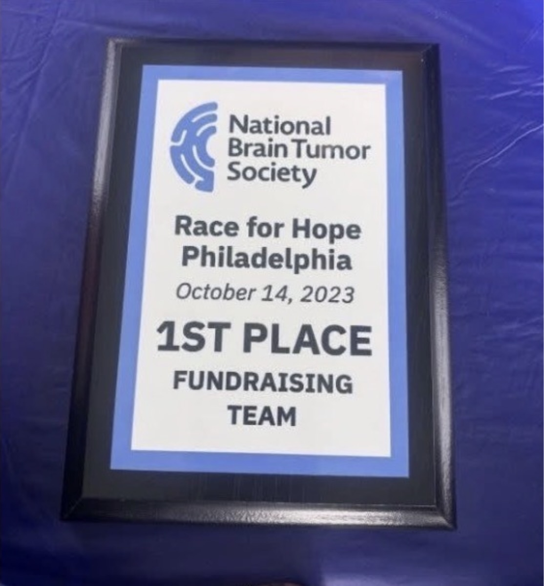

Through the Kevin Humes Memorial Foundation, we continue to honor Kevin’s memory by supporting organizations and families in our community. This holiday season, the Foundation was proud to make donations to three meaningful causes, each representing the compassion and generosity Kevin shared throughout his life. 

 

### Giving Back to Children at CHOP 

The Foundation once again supported the Children’s Hospital of Philadelphia (CHOP) Toy Drive. This year, CHOP introduced new guidelines requiring toy donations to be made virtually rather than through in-kind donations. We were still excited to fill our online cart with toys for children spending the holidays in the hospital — including plenty of LEGOs, one of Kevin’s favorite hobbies. These gifts help bring moments of happiness, comfort, and normalcy to children and families during what can be an especially difficult time. 

 

### Supporting Local Families Through Love Works 

We also donated toys and food to the Love Works Resource Center, helping provide essential items and holiday gifts to local families in need. Supporting families in our own community is one of the many ways we can continue the values he lived by and make a difference in his name. 

 

### Honoring a Friend Through the National Brain Tumor Society 

Our third donation was made to the National Brain Tumor Society in memory of a dear friend and neighbor. The donation supported fundraising efforts for The National Brain Tumor Society’s Race for Hope Greater Philadelphia and helped her team reach the top ranks of fundraisers. It was a meaningful way for the Foundation to support an important cause while honoring someone special to our family and community. 

 

Every donation made through the Kevin Humes Memorial Foundation is a reminder that Kevin’s legacy continues to make a difference. Through the generosity of Kevin’s Village — our family, friends, and supporters — we are able to turn Kevin’s memory into meaningful acts of kindness. Whether it is bringing a smile to a child at CHOP, helping a local famil, or supporting a cause close to someone's heart, each gift carries a little piece of Kevin’s spirit forward. 

Together, we can continue to shine Kevin’s light.  

Thank you for being part of Kevin’s Village. ❤️

