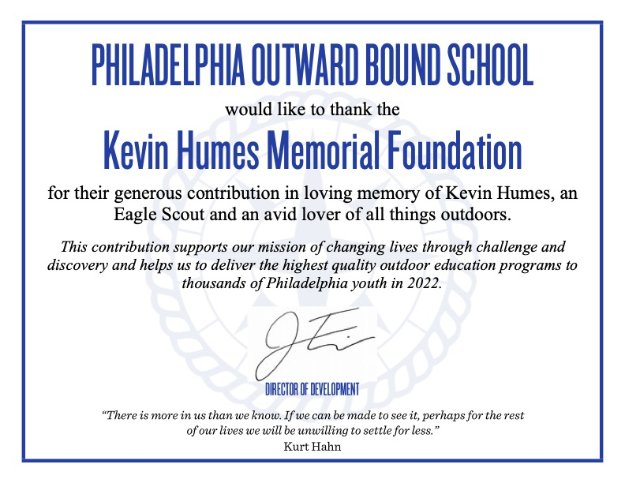
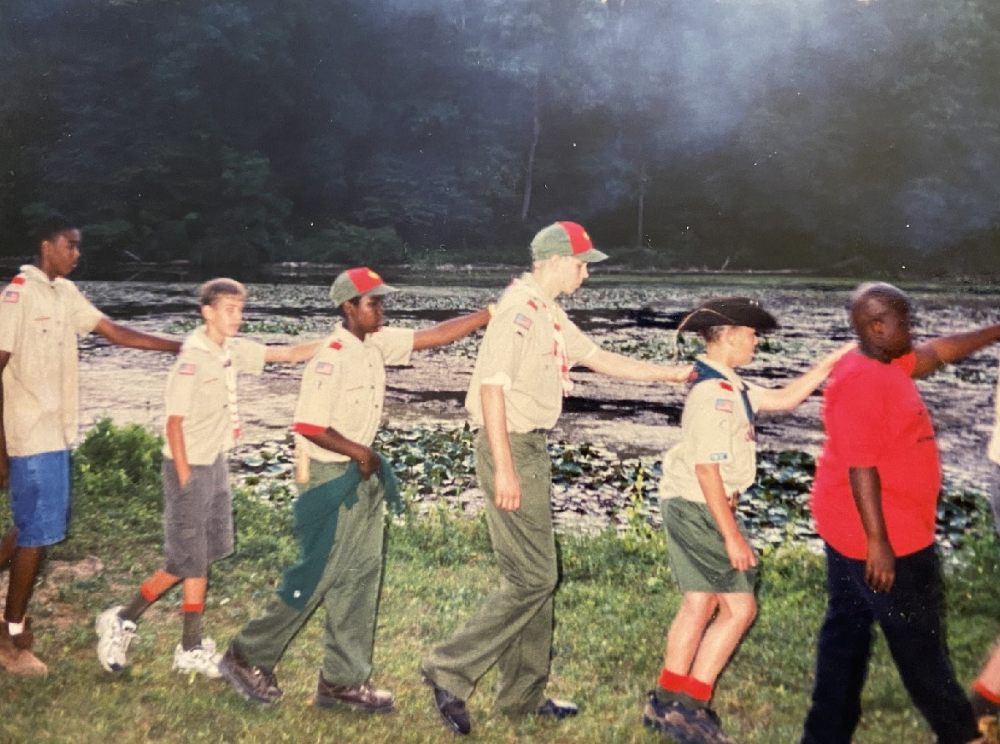
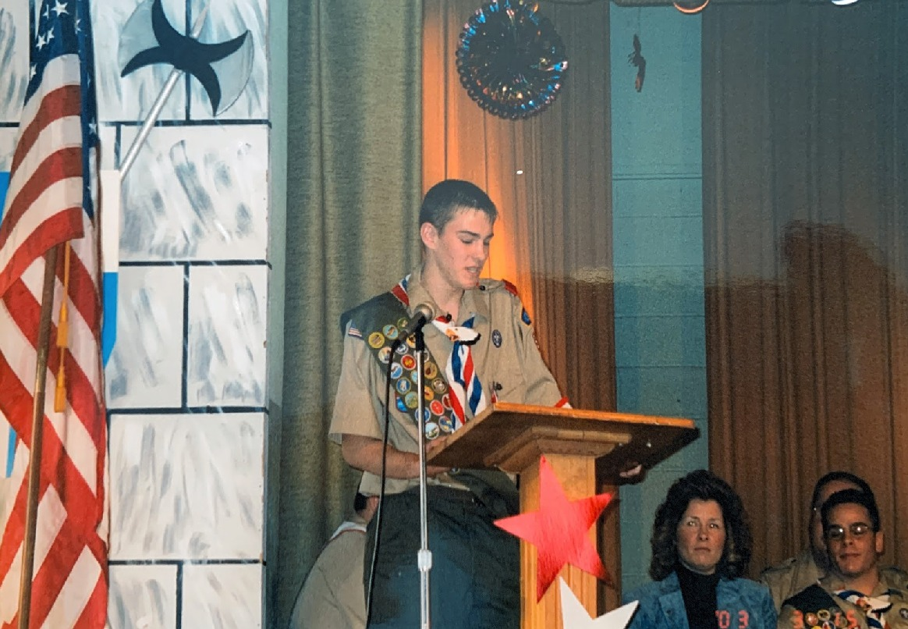
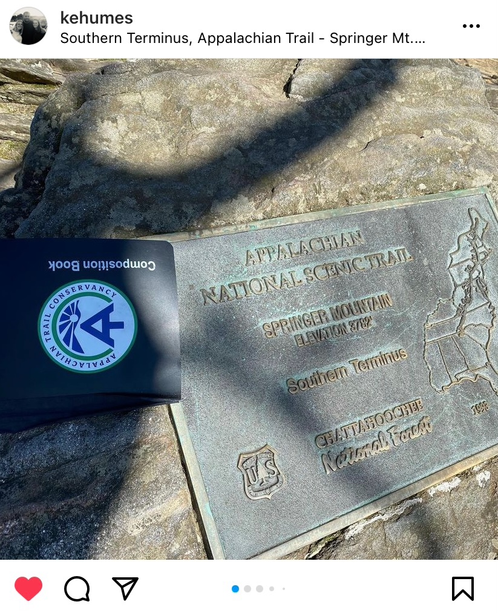

The Kevin Humes Memorial Foundation has made a donation in Kevin's memory to The
Philadelphia Outward Bound School. An added bonus: All donations are doubled in the
month of May!

Kevin was a lover of all things outdoors. He joined Boy Scouts at a young age and
ultimately earned his badge as an Eagle Scout. Through the Boy Scout program, Kevin
spent many years of his life exploring the outdoors. He carried this love of nature into his
adulthood. When he moved to Atlanta, he began hiking the Appalachian trail.

*The Philadelphia Outward Bound School (POBS) is a non-profit experiential education
organization that serves people of all ages and backgrounds through active learning
expeditions that inspire character development, self-discovery and service both in and out
of the classroom.*

The Philadelphia Outward Bound School is a program that shares Kevin’s love of learning
and growing as individuals through outdoor exploration. Our contribution will help to deliver
outdoor educational experiences to over 7,000 students in 2022!
If you are interested in learning more about The Philadelphia Outward Bound School, you can find more information on their site here: 

[https://outwardboundphiladelphia.org](https://outwardboundphiladelphia.org)

